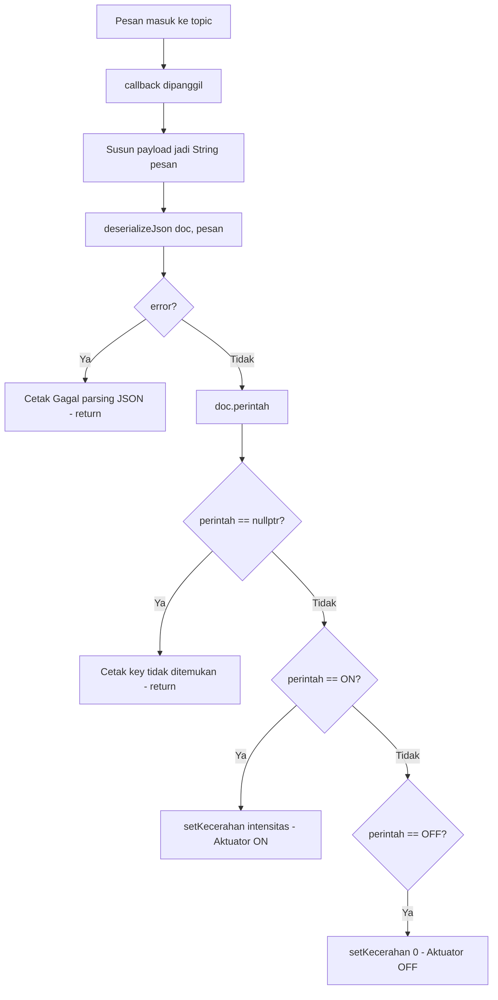
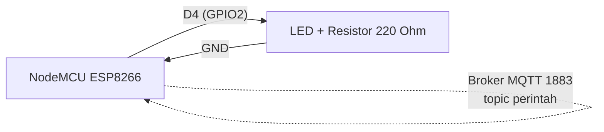
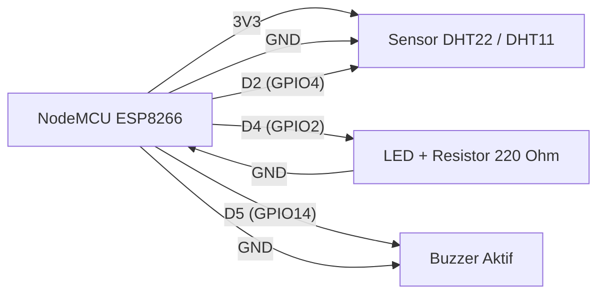
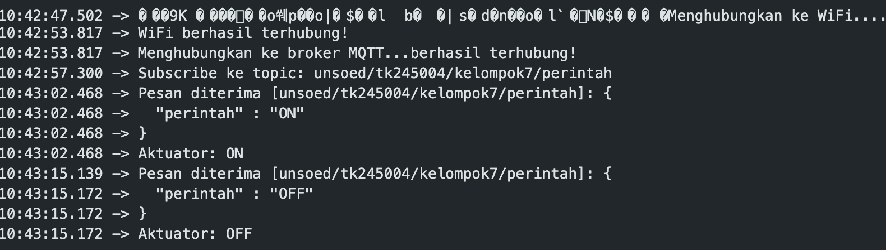
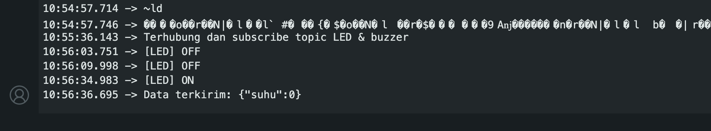

# Praktikum IoT - Modul 4: Komunikasi dan Pertukaran Data (Publish dan Subscribe)

Dokumentasi praktikum Modul 4 IoT: implementasi komunikasi data dua arah (*bidirectional* / *full duplex*) pada ESP8266 (NodeMCU), yaitu menerima perintah kendali aktuator melalui mekanisme **subscribe** + deserialisasi JSON, sekaligus mempublikasikan data sensor secara bersamaan.

> Catatan: Di modul memakai ESP32 (`WiFi.h`, LED di GPIO26), padahal praktikum memakai ESP8266 (NodeMCU) dengan `ESP8266WiFi.h` dan LED bawaan di GPIO2 (D4). Broker yang dipakai adalah HiveMQ publik (`broker.hivemq.com:1883`, tanpa TLS).

---

## 1. Percobaan 4A: Subscribe dan Deserialisasi Data JSON untuk Kendali Aktuator

### A. Penjelasan Singkat Percobaan

ESP8266 melakukan *subscribe* ke topic perintah pada broker MQTT, menerima pesan JSON, mendeserialisasinya, lalu mengendalikan LED (PWM) sesuai nilai `perintah` dan `intensitas`. Serial Monitor menampilkan pesan mentah yang diterima beserta hasil parsing.

### B. Library & Dependencies

- **ESP8266WiFi** (`ESP8266WiFi.h`, bawaan core ESP8266)
- **PubSubClient by Nick O'Leary** (`PubSubClient.h`, install via Library Manager)
- **ArduinoJson by Benoit Blanchon** (`ArduinoJson.h`, install via Library Manager)

### C. Penjelasan Kode & Fungsi (`percobaan1.cpp`)

```cpp
#include <ESP8266WiFi.h>
#include <PubSubClient.h>
#include <ArduinoJson.h>

const char* ssid = "Atharva";
const char* password = "starlink";
const char* mqttServer = "broker.hivemq.com";
const int mqttPort = 1883;
const char* topicPerintah = "unsoed/tk245004/kelompok7/perintah";

const int ledPin = 2;                 // GPIO2 (D4) = LED bawaan NodeMCU
const bool LED_ACTIVE_LOW = true;     // true untuk LED bawaan
const int pwmFreq = 5000;             // frekuensi PWM 5 kHz
const int pwmRange = 255;             // rentang nilai 0-255

WiFiClient espClient;
PubSubClient client(espClient);

void setKecerahan(int nilai) {
  nilai = constrain(nilai, 0, 255);
  analogWrite(ledPin, LED_ACTIVE_LOW ? (255 - nilai) : nilai);
}

void callback(char* topic, byte* payload, unsigned int length) {
  String pesan;
  for (unsigned int i = 0; i < length; i++) {
    pesan += (char)payload[i];
  }

  Serial.print("Pesan diterima [");
  Serial.print(topic);
  Serial.print("]: ");
  Serial.println(pesan);

  JsonDocument doc;
  DeserializationError error = deserializeJson(doc, pesan);
  if (error) {
    Serial.print("Gagal parsing JSON: ");
    Serial.println(error.c_str());
    return;
  }

  const char* perintah = doc["perintah"];
  if (perintah == nullptr) {
    Serial.println("Key 'perintah' tidak ditemukan");
    return;
  }

  int intensitas = doc["intensitas"] | 255;
  intensitas = constrain(intensitas, 0, 255);

  if (String(perintah) == "ON") {
    setKecerahan(intensitas);
    Serial.print("Aktuator: ON, intensitas = ");
    Serial.println(intensitas);
  } else if (String(perintah) == "OFF") {
    setKecerahan(0);
    Serial.println("Aktuator: OFF");
  }
}

void hubungkanWiFi() {
  WiFi.begin(ssid, password);
  Serial.print("Menghubungkan ke WiFi");
  while (WiFi.status() != WL_CONNECTED) {
    delay(500);
    Serial.print(".");
  }
  Serial.println("\nWiFi berhasil terhubung!");
}

void hubungkanMQTT() {
  while (!client.connected()) {
    Serial.print("Menghubungkan ke broker MQTT...");
    String clientId = "ESP8266Client-" + String(random(0xffff), HEX);
    if (client.connect(clientId.c_str())) {
      Serial.println("berhasil terhubung!");
      client.subscribe(topicPerintah);
      Serial.print("Subscribe ke topic: ");
      Serial.println(topicPerintah);
    } else {
      Serial.print("gagal, rc=");
      Serial.print(client.state());
      Serial.println(" coba lagi dalam 2 detik");
      delay(2000);
    }
  }
}

void setup() {
  Serial.begin(115200);

  pinMode(ledPin, OUTPUT);
  analogWriteRange(pwmRange);   // nilai PWM 0-255
  analogWriteFreq(pwmFreq);     // frekuensi 5 kHz
  setKecerahan(0);              // LED mati saat awal

  hubungkanWiFi();
  client.setServer(mqttServer, mqttPort);
  client.setCallback(callback);
}

void loop() {
  if (!client.connected()) {
    hubungkanMQTT();
  }
  client.loop();
}
```

- `#include <ESP8266WiFi.h>`: Pustaka WiFi ESP8266 (pengganti `WiFi.h` versi ESP32 di modul).
- `#include <PubSubClient.h>`: Pustaka MQTT publish-subscribe.
- `#include <ArduinoJson.h>`: Pustaka parsing/pembuatan JSON.
- `const char* ssid / password`: Nama dan kata sandi WiFi tujuan.
- `const char* mqttServer / mqttPort`: Alamat broker MQTT publik dan port 1883 (non-TLS).
- `const char* topicPerintah`: Topic unik tempat perintah kendali di-subscribe.
- `const int ledPin = 2`: Mapping pin LED ke GPIO2 (D4) NodeMCU.
- `const bool LED_ACTIVE_LOW = true`: Penanda LED bawaan aktif saat level LOW.
- `WiFiClient espClient; + PubSubClient client(espClient)`: Membuat client MQTT di atas koneksi TCP biasa.
- `setKecerahan(int nilai)`: Helper menulis nilai PWM 0-255 ke LED, membalik nilai jika *active-low*.
- `callback(topic, payload, length)`: Fungsi yang dipanggil otomatis tiap ada pesan masuk ke topic yang di-subscribe.
- `pesan += (char)payload[i]`: Menyusun buffer `payload` (bukan null-terminated) menjadi `String`.
- `deserializeJson(doc, pesan)`: Mengubah teks JSON menjadi objek `doc` yang bisa diakses per-key.
- `doc["perintah"]` / `doc["intensitas"] | 255`: Mengambil nilai key; nilai default 255 jika key tidak ada.
- `constrain(intensitas, 0, 255)`: Membatasi nilai kecerahan agar valid.
- `analogWrite(...)`: Mengeluarkan sinyal PWM ke LED pada ESP8266 (padanan `ledcWrite` di ESP32).
- `analogWriteRange(pwmRange)` / `analogWriteFreq(pwmFreq)`: Mengatur rentang dan frekuensi PWM ESP8266.
- `client.subscribe(topicPerintah)`: Mendaftarkan diri menerima pesan dari topic tersebut.
- `client.setCallback(callback)`: Mendaftarkan fungsi callback yang dijalankan saat pesan diterima.
- `client.loop()`: Memproses paket masuk dan menjaga koneksi ke broker; wajib dipanggil rutin.

### D. Penjelasan Percabangan / Conditional

1.  `while (WiFi.status() != WL_CONNECTED)` di `hubungkanWiFi()`: Menahan program sampai WiFi tersambung, mencetak `.` tiap 500 ms.
2.  `while (!client.connected())` di `hubungkanMQTT()`:
    - Selama belum konek, coba `client.connect(clientId)` dengan `clientId` acak.
    - Jika `true`: cetak berhasil, jalankan `subscribe(topicPerintah)`.
    - Jika `false`: cetak return code `client.state()`, tunggu 2 detik, ulangi.
3.  `if (error)` di `callback()`: Jika parsing JSON gagal, cetak pesan error via `error.c_str()` lalu `return`.
4.  `if (perintah == nullptr)`: Validasi keberadaan key `perintah`; jika tidak ada, keluar dari callback.
5.  `if (String(perintah) == "ON")`: Set kecerahan sesuai `intensitas`.
6.  `else if (String(perintah) == "OFF")`: Set kecerahan ke 0 (LED mati).
7.  `if (!client.connected())` di `loop()`: Reconnect otomatis ke broker bila koneksi putus.

---

## 2. Percobaan 4B: Pertukaran Data Dua Arah (Publish dan Subscribe Secara Bersamaan)

### A. Penjelasan Singkat Percobaan

Integrasi Modul 3 (publish) dan Percobaan 4A (subscribe): ESP8266 mempublikasikan data suhu ke `topicData` setiap 5 detik secara non-blocking, sekaligus mendengarkan dua topic perintah (`topicPerintah` untuk LED dan `topicBuzzer` untuk buzzer), sehingga komunikasi berjalan *full duplex*.

### B. Library & Dependencies

- **ESP8266WiFi** (`ESP8266WiFi.h`, bawaan core ESP8266)
- **PubSubClient by Nick O'Leary** (`PubSubClient.h`, install via Library Manager)
- **ArduinoJson by Benoit Blanchon** (`ArduinoJson.h`, install via Library Manager)
- **DHT sensor library by Adafruit** (`DHT.h`)

### C. Penjelasan Kode & Fungsi (`percobaan2.cpp`)

```cpp
#include <ESP8266WiFi.h>
#include <PubSubClient.h>
#include <ArduinoJson.h>
#include <DHT.h>

const char* ssid = "Atharva";
const char* password = "starlink";
const char* mqttServer = "broker.hivemq.com";
const int mqttPort = 1883;
const char* topicData = "unsoed/tk245004/kelompok7/data";
const char* topicPerintah = "unsoed/tk245004/kelompok7/perintah";          // LED
const char* topicBuzzer = "unsoed/tk245004/kelompok7/perintah/buzzer";     // Buzzer

#define DHTPIN 4        // GPIO4 = D2
#define DHTTYPE DHT22   // ganti ke DHT11 jika memakai sensor DHT11

const int ledPin = 2;                // GPIO2 = D4 (LED bawaan)
const bool LED_ACTIVE_LOW = true;    // LED bawaan: LOW = menyala
const int buzzerPin = 14;            // GPIO14 = D5 (buzzer aktif)

DHT dht(DHTPIN, DHTTYPE);
WiFiClient espClient;
PubSubClient client(espClient);

unsigned long waktuTerakhirPublish = 0;
const long intervalPublish = 5000;

void setLed(bool on) {
  digitalWrite(ledPin, (on != LED_ACTIVE_LOW) ? HIGH : LOW);
}

void callback(char* topic, byte* payload, unsigned int length) {
  String pesan;
  for (unsigned int i = 0; i < length; i++) pesan += (char)payload[i];

  JsonDocument doc;
  if (deserializeJson(doc, pesan)) {
    Serial.println("Gagal parsing JSON");
    return;
  }

  const char* perintah = doc["perintah"];
  if (perintah == nullptr) return;
  bool on = (String(perintah) == "ON");

  if (String(topic) == topicPerintah) {
    setLed(on);
    Serial.print("[LED] ");
    Serial.println(perintah);
  } else if (String(topic) == topicBuzzer) {
    digitalWrite(buzzerPin, on ? HIGH : LOW);
    Serial.print("[Buzzer] ");
    Serial.println(perintah);
  }
}

void hubungkanWiFi() {
  WiFi.begin(ssid, password);
  while (WiFi.status() != WL_CONNECTED) delay(500);
  Serial.println("WiFi berhasil terhubung!");
}

void hubungkanMQTT() {
  while (!client.connected()) {
    String clientId = "ESP8266Client-" + String(random(0xffff), HEX);
    if (client.connect(clientId.c_str())) {
      client.subscribe(topicPerintah);
      client.subscribe(topicBuzzer);
      Serial.println("Terhubung dan subscribe topic LED & buzzer");
    } else {
      delay(2000);
    }
  }
}

void setup() {
  Serial.begin(115200);
  pinMode(ledPin, OUTPUT);
  setLed(false);                   // LED mati saat awal
  pinMode(buzzerPin, OUTPUT);
  digitalWrite(buzzerPin, LOW);    // buzzer mati saat awal
  dht.begin();
  hubungkanWiFi();
  client.setServer(mqttServer, mqttPort);
  client.setCallback(callback);
}

void loop() {
  if (!client.connected()) hubungkanMQTT();
  client.loop();

  if (millis() - waktuTerakhirPublish > intervalPublish) {
    waktuTerakhirPublish = millis();
    float suhu = dht.readTemperature();
    if (!isnan(suhu)) {
      JsonDocument doc;
      doc["suhu"] = suhu;
      char buffer[128];
      serializeJson(doc, buffer);
      client.publish(topicData, buffer);
      Serial.print("Data terkirim: ");
      Serial.println(buffer);
    }
  }
}
```

- `#include <DHT.h>`: Pustaka sensor DHT (suhu/kelembaban).
- `const char* topicData / topicPerintah / topicBuzzer`: Tiga topic — satu untuk kirim data sensor, dua untuk terima perintah aktuator.
- `#define DHTPIN 4` / `#define DHTTYPE DHT22`: Konfigurasi pin dan tipe sensor DHT.
- `const int ledPin = 2` / `const int buzzerPin = 14`: Mapping pin LED (GPIO2/D4) dan buzzer (GPIO14/D5).
- `unsigned long waktuTerakhirPublish` / `intervalPublish = 5000`: Variabel penanda waktu untuk penjadwalan publish non-blocking.
- `setLed(bool on)`: Helper menyalakan/mematikan LED memperhitungkan logika *active-low*.
- `client.subscribe(topicPerintah)` & `client.subscribe(topicBuzzer)`: Subscribe ke lebih dari satu topic.
- `if (String(topic) == topicPerintah)` di `callback()`: Karena `callback` menerima pesan dari semua topic yang di-subscribe, topic dicek untuk memilih aktuator yang tepat.
- `dht.readTemperature()`: Membaca suhu lingkungan (°C) bertipe float.
- `doc["suhu"] = suhu; + serializeJson(doc, buffer)`: Membuat JSON lalu menuliskannya ke `char buffer[128]`.
- `client.publish(topicData, buffer)`: Mempublikasikan payload suhu ke broker.
- `client.loop()`: Memproses pesan masuk; wajib dipanggil tiap iterasi agar subscribe tetap responsif.

### D. Penjelasan Percabangan / Conditional

1.  `while (WiFi.status() != WL_CONNECTED)`: Tahan sampai WiFi tersambung.
2.  `while (!client.connected())`: Retry koneksi broker tiap 2 detik; setelah berhasil langsung subscribe kedua topic aktuator.
3.  `if (deserializeJson(doc, pesan))`: Jika parsing gagal (`return` non-nol), cetak pesan dan `return`.
4.  `if (perintah == nullptr) return;`: Abaikan pesan tanpa key `perintah`.
5.  `if (String(topic) == topicPerintah)` / `else if (String(topic) == topicBuzzer)`: Membedakan aktuator berdasarkan topic pengirim pesan.
6.  `if (!client.connected())` di `loop()`: Reconnect otomatis bila koneksi broker putus.
7.  `if (millis() - waktuTerakhirPublish > intervalPublish)`: Penjadwalan publish tiap 5 detik **non-blocking**; menggantikan `delay()` agar `client.loop()` tetap berjalan.
8.  `if (!isnan(suhu))`: Kirim data hanya jika pembacaan sensor valid (bukan *Not a Number*).

---

## 3. Jawaban Pertanyaan Praktikum

### 3.1 Percobaan 4A — Subscribe dan Deserialisasi JSON (4.5.4)

#### 1. Gambarkan diagram alur (flowchart) proses penerimaan dan pemrosesan pesan pada fungsi callback di atas!



Alur: terima payload → rakit `String` → deserialisasi → validasi parsing & key → eksekusi aksi ON/OFF berdasarkan nilai JSON.

#### 2. Apa yang akan terjadi apabila pesan yang dipublikasikan bukan merupakan format JSON yang valid?

`deserializeJson()` mengembalikan objek `DeserializationError` bernilai non-nol, sehingga masuk cabang `if (error)`. Program mencetak `Gagal parsing JSON: <pesan error>` lalu `return` tanpa mengubah pin LED — aktuator tetap pada kondisi terakhir. Jadi program tidak *crash*, hanya mengabaikan pesan cacat.

#### 3. Jelaskan mengapa fungsi `client.subscribe()` dipanggil di dalam fungsi `hubungkanMQTT()`, bukan di dalam `setup()`!

Karena `subscribe` hanya sah dilakukan ketika client sudah **terhubung** ke broker. `hubungkanMQTT()` adalah fungsi yang memastikan koneksi (loop `while (!client.connected())`). Jika `subscribe` ditaruh di `setup()` sebelum koneksi terbentuk, perintah akan gagal. Menaruhnya di dalam `hubungkanMQTT()` juga membuat *re-subscribe* otomatis terjadi setiap kali program melakukan reconnect setelah koneksi putus — sesuatu yang tidak bisa dilakukan `setup()` yang hanya berjalan sekali.

#### 4. Modifikasi program agar data JSON juga memuat `intensitas` untuk mengatur kecerahan LED via PWM

Modifikasi sudah diterapkan pada `percobaan1.cpp`:

```cpp
const bool LED_ACTIVE_LOW = true;     // true untuk LED bawaan
const int pwmFreq = 5000;             // frekuensi PWM 5 kHz
const int pwmRange = 255;             // rentang nilai 0-255

void setKecerahan(int nilai) {
  nilai = constrain(nilai, 0, 255);
  analogWrite(ledPin, LED_ACTIVE_LOW ? (255 - nilai) : nilai);
}
// di setup():
analogWriteRange(pwmRange);
analogWriteFreq(pwmFreq);
setKecerahan(0);
// di callback():
int intensitas = doc["intensitas"] | 255;
intensitas = constrain(intensitas, 0, 255);
if (String(perintah) == "ON") {
  setKecerahan(intensitas);
  Serial.print("Aktuator: ON, intensitas = ");
  Serial.println(intensitas);
}
```

#### Penjelasan Setiap Baris Kode Modifikasi:

- `const bool LED_ACTIVE_LOW = true`: Penanda LED bawaan aktif saat level LOW; dibutuhkan agar nilai PWM dibalik (`255 - nilai`) sehingga angka besar berarti terang.
- `const int pwmFreq = 5000`: Menetapkan frekuensi PWM 5 kHz — cukup tinggi agar LED tak terlihat berkedip.
- `const int pwmRange = 255`: Rentang resolusi PWM 8-bit (0–255), sesuai nilai `intensitas`.
- `void setKecerahan(int nilai)`: Fungsi pembungkus yang menyatukan pembatasan nilai dan koreksi *active-low*.
- `nilai = constrain(nilai, 0, 255)`: Menjaga nilai tetap di rentang valid agar tidak overflow.
- `analogWrite(ledPin, ...)`: Mengeluarkan PWM ke GPIO2; pada ESP8266 ini padanan `ledcWrite` di ESP32.
- `LED_ACTIVE_LOW ? (255 - nilai) : nilai`: Membalik duty cycle untuk LED active-low sehingga `intensitas=200` benar-benar lebih terang dari `intensitas=50`.
- `analogWriteRange(pwmRange)` di `setup()`: Mengatur resolusi PWM ESP8266 menjadi 0–255.
- `analogWriteFreq(pwmFreq)` di `setup()`: Mengatur frekuensi PWM ke 5 kHz.
- `setKecerahan(0)` di `setup()`: Memastikan LED mati saat perangkat baru menyala.
- `int intensitas = doc["intensitas"] | 255` di `callback()`: Mengambil key `intensitas`; jika tidak ada di JSON, default 255 (terang penuh).
- `constrain(intensitas, 0, 255)`: Membatasi nilai dari pesan yang mungkin di luar rentang.
- `setKecerahan(intensitas)`: Menerapkan kecerahan hasil parsing ke LED via PWM.

### 3.2 Percobaan 4B — Pertukaran Data Dua Arah (4.6.4)

#### 1. Mengapa penggunaan `delay()` yang lama sebaiknya dihindari pada program yang menggabungkan proses publish dan subscribe secara bersamaan?

`delay()` bersifat **blocking** — seluruh program berhenti, termasuk `client.loop()` yang bertugas memproses pesan MQTT masuk dan menjaga koneksi. Jika `delay(5000)` dipakai untuk menjadwalkan publish, perintah kendali yang datang di sela-sela delay baru diproses setelah 5 detik (aktuator lambat merespons), bahkan broker bisa menganggap koneksi mati (keep-alive timeout) dan memutus client.

#### 2. Jelaskan cara kerja mekanisme non-blocking menggunakan fungsi `millis()` pada program di atas!

`millis()` mengembalikan jumlah milidetik sejak ESP menyala. Program menyimpan `waktuTerakhirPublish`, lalu tiap iterasi `loop()` mengecek `if (millis() - waktuTerakhirPublish > intervalPublish)`. Selama selisih belum melewati 5000 ms, blok publish dilewati dan `client.loop()` terus berjalan memproses pesan masuk. Begitu waktunya tiba, stempel waktu diperbarui dan data dipublikasikan. Tidak ada titik di mana program berhenti menunggu, sehingga publish dan subscribe berjalan bergantian di dalam satu loop yang sama.

#### 3. Apa yang akan terjadi apabila fungsi `client.loop()` jarang dipanggil (misalnya hanya sekali setiap 10 detik)?

1. **Pesan masuk tertunda** — pesan subscribe menumpuk di buffer TCP dan baru diproses tiap 10 detik, aktuator terasa lag.
2. **Keep-alive gagal** — broker MQTT punya `keepalive` (default 15 detik di PubSubClient); jarang memanggil `loop()` membuat PINGREQ tak terkirim sehingga broker memutus koneksi dan program harus reconnect terus-menerus.
3. **Publish bisa gagal** — saat koneksi dinilai mati, `client.publish()` mengembalikan `false`.

#### 4. Modifikasi program agar menambahkan satu topic perintah baru untuk mengendalikan buzzer, dengan callback yang membedakan topic

Modifikasi sudah diterapkan pada `percobaan2.cpp`:

```cpp
const char* topicPerintah = "unsoed/tk245004/kelompok7/perintah";          // LED
const char* topicBuzzer = "unsoed/tk245004/kelompok7/perintah/buzzer";     // Buzzer
const int buzzerPin = 14;            // GPIO14 = D5 (buzzer aktif)

// di callback():
if (String(topic) == topicPerintah) {
  setLed(on);
  Serial.print("[LED] ");
  Serial.println(perintah);
} else if (String(topic) == topicBuzzer) {
  digitalWrite(buzzerPin, on ? HIGH : LOW);
  Serial.print("[Buzzer] ");
  Serial.println(perintah);
}
// di hubungkanMQTT():
client.subscribe(topicPerintah);
client.subscribe(topicBuzzer);
// di setup():
pinMode(buzzerPin, OUTPUT);
digitalWrite(buzzerPin, LOW);
```

#### Penjelasan Setiap Baris Kode Modifikasi:

- `const char* topicBuzzer = ".../perintah/buzzer"`: Mendefinisikan topic kedua untuk perintah buzzer, terpisah dari topic LED.
- `const int buzzerPin = 14`: Mapping pin buzzer ke GPIO14 (D5) NodeMCU.
- `client.subscribe(topicBuzzer)`: Mendaftarkan diri ke topic buzzer **selain** topic LED; keduanya memakai satu koneksi client yang sama.
- `pinMode(buzzerPin, OUTPUT)`: Menetapkan pin buzzer sebagai output kontrol.
- `digitalWrite(buzzerPin, LOW)` di `setup()`: Memastikan buzzer mati saat perangkat baru menyala.
- `if (String(topic) == topicPerintah)`: Karena `callback` yang sama menerima pesan dari dua topic, topic diperiksa untuk membedakan aktuator.
- `setLed(on)` / `Serial.print("[LED] ")`: Menangani perintah untuk LED beserta log penandanya.
- `else if (String(topic) == topicBuzzer)`: Cabang untuk topic buzzer.
- `digitalWrite(buzzerPin, on ? HIGH : LOW)`: Menyalakan buzzer jika perintah `ON`, mematikannya jika `OFF`.
- `Serial.print("[Buzzer] ")`: Log penanda bahwa pesan diproses sebagai perintah buzzer.

### 3.3 Pertanyaan Analisis (4.7)

#### 1. Uraikan hasil tugas pada praktikum yang telah dilakukan pada setiap percobaan!

- **Percobaan 4A (Subscribe + Deserialisasi JSON):** ESP8266 berhasil gabung WiFi (`WiFi berhasil terhubung!`) lalu broker MQTT (`berhasil terhubung!`) dan mencetak `Subscribe ke topic: unsoed/tk245004/kelompok7/perintah`. Saat client MQTT mem-publish `{"perintah":"ON","intensitas":200}`, Serial menampilkan `Pesan diterima [...]` + isi JSON, lalu `Aktuator: ON, intensitas = 200` dan LED menyala sesuai kecerahan. Publish `{"perintah":"OFF"}` memunculkan `Aktuator: OFF` dan LED mati. Pesan JSON cacat ditolak dengan `Gagal parsing JSON`.
- **Percobaan 4B (Dua Arah):** ESP8266 mem-publish `Data terkirim: {"suhu":xx.x}` ke `topicData` setiap 5 detik, sementara perintah dari `topicPerintah` (LED) dan `topicBuzzer` (buzzer) tetap diproses seketika — dibuktikan LED dan buzzer merespons cepat meski publish sensor berjalan. Client subscriber ke `topicData` menerima data suhu dengan benar; koneksi broker stabil selama pengujian tanpa `delay()` blocking.

#### 2. Bandingkan mekanisme komunikasi satu arah (publish saja, Modul 3) dengan komunikasi dua arah (publish dan subscribe) pada modul ini!

- **Satu arah (Modul 3):** Perangkat hanya menjadi *publisher*; aliran data searah ESP → broker → subscriber. Tidak ada kemampuan menerima perintah, aktuator hanya dijalankan oleh logika lokal.
- **Dua arah (Modul 4):** Perangkat sekaligus *publisher* dan *subscriber*. Data sensor naik ke broker sementara perintah kendali turun dari aplikasi ke perangkat pada saat yang sama. Untuk itu dibutuhkan `setCallback()` + `client.subscribe()` + pemanggilan `client.loop()` rutin, serta mengganti `delay()` dengan penjadwalan `millis()` agar kedua aliran tidak saling memblokir.

#### 3. Mengapa pendekatan non-blocking (`millis()`) lebih sesuai dibanding blocking (`delay()`) pada sistem IoT yang butuh komunikasi dua arah real-time?

`delay()` menghentikan seluruh eksekusi, termasuk pemrosesan pesan masuk dan keep-alive broker, sehingga respons aktuator tertunda dan koneksi berisiko diputus. `millis()` hanya *mengecek waktu* tanpa menghentikan program, jadi `client.loop()` tetap berjalan setiap iterasi: perintah kendali diproses hampir seketika (real-time) sementara publish sensor tetap terjadwal. Inilah prasyarat komunikasi *full duplex* yang stabil.

#### 4. Contoh penerapan komunikasi dua arah pada sistem IoT nyata (sesuai bidang peminatan), dan manfaatnya dibanding sistem satu arah!

Bidang **pertanian/agritech — smart greenhouse**. Sensor DHT22, sensor kelembaban tanah, dan LDR secara berkala mem-publish data ke broker: suhu, kelembaban, intensitas cahaya (aliran naik). Bersamaan itu perangkat subscribe ke topic perintah untuk menyalakan/mematikan pompa irigasi, kipas pendingin, atau lampu grow-light dari dashboard petani (aliran turun) — persis pola Percobaan 4B yang diperluas. Manfaat dibanding satu arah: petani tak sekadar *memantau*, tetapi bisa **bertindak langsung dari jarak jauh**; aktuator dapat diubah setelannya (misal intensitas lampu atau durasi pompa) tanpa menempel ulang kode; sistem lebih adaptif terhadap kondisi lapangan dan menghemat air/energi karena keputusan bisa berasal dari manusia maupun otomasi di server.

---

## 4. Skematik & Diagram Rangkaian

Percobaan ini menggabungkan aktuator (Modul 1) dan komunikasi jaringan (Modul 3), sehingga ada wiring breadboard.

### Rangkaian Percobaan 4A (LED PWM)



### Rangkaian Percobaan 4B (DHT + LED + Buzzer)



### Topologi Pertukaran Data


### Hasil Percobaan

#### Output Percobaan 1 (Subscribe + Deserialisasi JSON)

Serial Monitor menampilkan proses koneksi, `Subscribe ke topic`, lalu `Pesan diterima` + `Aktuator: ON/OFF` setiap kali perintah dipublish.



#### Output Percobaan 2 (Pertukaran Data Dua Arah)

Serial Monitor menampilkan `Data terkirim: {"suhu":...}` tiap 5 detik, diselingi log `[LED]`/`[Buzzer]` saat perintah kendali diterima.


